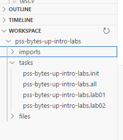
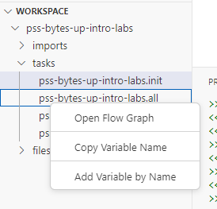
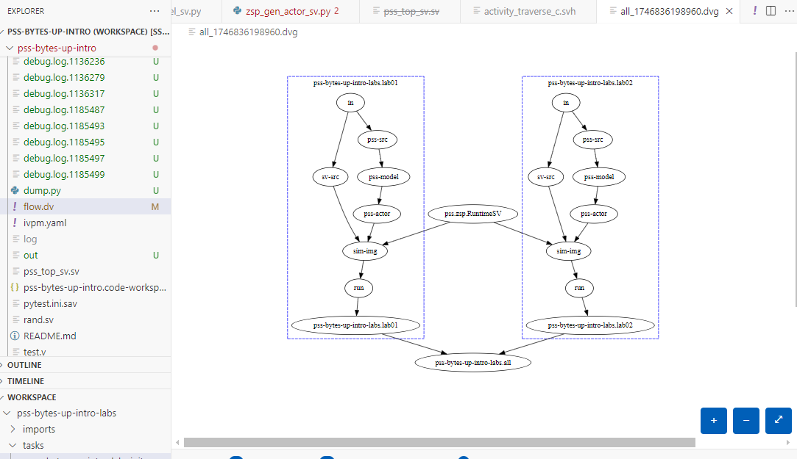
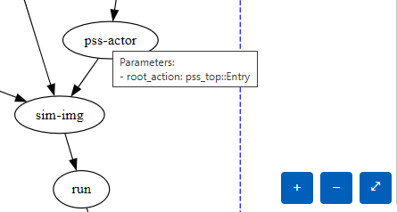

.. DV Flow VSCode Extension documentation master file, created by
   sphinx-quickstart on Fri May  9 15:22:25 2025.
   You can adapt this file completely to your liking, but it should at least
   contain the root `toctree` directive.
########################
DV Flow VSCode Extension
########################

DV Flow provides an extension for the `VSCode <https://code.visualstudio.com/>`_ development 
environment to assist in developing and using DV Flow descriptions. The extension provides rich 
language support, visual task graph exploration, real-time execution monitoring, and integrated 
debugging capabilities for DV Flow workflows.

.. contents::
    :depth: 3

Installation
============

The extension can be installed from the `VSCode Marketplace <https://marketplace.visualstudio.com/items?itemName=matthew-ballance.vscode-dv-flow>`_.

Requirements
------------

The DV Flow extension requires the `DV Flow Manager <https://dv-flow.github.io/dv-flow-mgr>`_ 
Python package to be installed in a Python environment accessible to VSCode.

Configuration
=============

DFM Executable Path
-------------------

The DV Flow extension searches for the DV Flow Manager (dfm) executable as follows:

1. Checks the ``dvflow.dfmPath`` setting in VSCode settings
2. Checks the ``python.defaultInterpreterPath`` setting in the workspace settings
3. Checks for the existence of an `IVPM <https://fvutils.github.io/ivpm>`_ packages directory
4. Checks the PATH for the ``python3`` executable

.. image:: imgs/dfmPath_setting.png

You can configure the ``dfmPath`` setting in VSCode settings. The path should point to 
the ``dfm`` executable or a Python interpreter with the DV Flow Manager package installed.

Workspace Discovery
-------------------

The extension automatically discovers flow files in your workspace using configurable patterns:

**dvflow.discovery.include** (default: ``**/flow.dv``, ``**/flow.yaml``, ``**/flow.yml``)
  Glob patterns to include when discovering flow files

**dvflow.discovery.exclude** (default: ``**/node_modules/**``, ``**/build/**``, ``**/rundir/**``, ``**/.git/**``)
  Glob patterns to exclude when discovering flow files

**dvflow.discovery.roots** (default: empty)
  Explicit glob patterns for standalone root packages. If empty, roots are auto-detected

**dvflow.discovery.importedOnly** (default: empty)
  Glob patterns for packages that should only be shown as imports, not as roots

Execution Settings
------------------

**dvflow.execution.rundirBase** (default: ``rundir``)
  Base directory for run directories, relative to workspace root

**dvflow.execution.isolateRoots** (default: ``true``)
  Create separate rundirs for each root package

UI Settings
-----------

**dvflow.ui.showRootInStatusBar** (default: ``true``)
  Show the active root package in the status bar

Debug Settings
--------------

**dvflow.debug.logDfmDiscovery** (default: ``false``)
  Log dfm executable discovery process to the output channel

Perfetto Trace Viewer Settings
-------------------------------

**dvflow.perfetto.url** (default: ``https://ui.perfetto.dev``)
  URL for the Perfetto UI. Use this to point to a self-hosted Perfetto instance for offline use.

**dvflow.perfetto.useLocalBundle** (default: ``false``)
  Use bundled Perfetto UI files instead of the online version

Features
========

Multi-Root Workspace Explorer
------------------------------

The DV Flow extension provides a comprehensive workspace explorer that displays all flow packages
in your workspace, organized by standalone roots and imported packages.

The workspace view shows:

* **Flow Roots** - Standalone packages that can be executed directly
* **Imported Packages** - Packages imported by root packages
* **Active Root** - The currently selected root for task execution (marked with ← ACTIVE)

Each package node expands to show:

* **Parameters** - Package-level parameters with their types and default values
* **Imports** - Both local and plugin imports with navigation support
* **Tasks** - All tasks organized by type (FileSet, Exec, Message, etc.)
* **Types** - Custom type definitions
* **Files** - Source files in the package

Root Selection
^^^^^^^^^^^^^^

Multiple flow roots can coexist in a workspace. To switch the active root:

* Click the package icon in the status bar, or
* Use the **DV Flow: Select Active Root** command (``Ctrl+Shift+R`` / ``Cmd+Shift+R``), or
* Right-click a root in the workspace view and select **Set as Active Root**

The active root is used for all task execution and debugging operations.

Discovery and Refresh
^^^^^^^^^^^^^^^^^^^^^

* Click the refresh icon (🔄) in the workspace view title to refresh the package tree
* Click the search icon (🔍) to re-discover flow roots in the workspace
* The workspace view automatically updates when flow files are modified

Task Graph Visualization
-------------------------

Interactive Graph View
^^^^^^^^^^^^^^^^^^^^^^

A graphical representation of a task's execution graph can be opened from multiple locations:

* Right-click a task in the workspace view and select **Open Flow Graph**
* Click the graph icon next to a task in the workspace view
* Use the CodeLens "Open Graph" link above task declarations in flow files
* Right-click in a flow.dv editor and select **Open Task Graph View**

The graph view displays:

* Task nodes with color-coding by type
* Dependency edges showing task execution order
* Hover tooltips showing parameter values and task details

Graph Features
^^^^^^^^^^^^^^

* **Zoom and Pan** - Use mouse wheel to zoom, drag to pan
* **Node Inspection** - Hover over nodes to see task parameters
* **Edge Labels** - Hover over edges to see dependency relationships
* **Auto-Layout** - Graph automatically arranges nodes for optimal visibility

Language Support
----------------

The extension provides comprehensive language support for flow.dv and flow.yaml files.

Syntax Highlighting
^^^^^^^^^^^^^^^^^^^

* YAML syntax highlighting with flow-specific token types
* Semantic highlighting for task names, parameters, and expressions

IntelliSense and Code Completion
^^^^^^^^^^^^^^^^^^^^^^^^^^^^^^^^^

The completion provider offers context-aware suggestions for:

* **Task Types** - Built-in task types (``std.Exec``, ``std.FileSet``, ``std.Message``, etc.)
* **Task Parameters** - Parameter names based on the task's ``uses:`` type
* **Task References** - Available tasks when completing ``needs:`` dependencies
* **Expression Variables** - Variables in ``${{ }}`` expressions
* **Import Names** - Package names when completing import references

Trigger completion with ``Ctrl+Space`` while editing flow files.

Hover Information
^^^^^^^^^^^^^^^^^

Hover over symbols to see:

* **Task Definitions** - Task type, description, and parameters
* **Task Types** - Built-in task documentation
* **Parameters** - Parameter types and default values
* **Task References** - Quick preview of referenced tasks
* **Imports** - Import paths and package information

Go to Definition
^^^^^^^^^^^^^^^^

Navigate to definitions with ``F12`` or ``Ctrl+Click``:

* Task names → task declaration
* Task types → type definition (if available)
* Import names → imported package file
* Fragment paths → fragment file
* Parameter references → parameter declaration

Find All References
^^^^^^^^^^^^^^^^^^^

Find all references to a symbol with ``Shift+F12``:

* Task references in ``needs:`` dependencies
* Parameter usage in expressions
* Import usage across files

Rename Refactoring
^^^^^^^^^^^^^^^^^^

Rename tasks and parameters with ``F2``:

* Renames all references across the file
* Updates task names in ``needs:`` dependencies
* Safe refactoring with validation

CodeLens
^^^^^^^^

Inline commands appear above task declarations:

* **Open Graph** - Opens the task dependency graph

Diagnostics
^^^^^^^^^^^

Real-time error and warning reporting for:

* Duplicate task names
* Undefined task references in dependencies
* Missing fragment files
* Invalid expression syntax

Task Execution
--------------

Run Panel
^^^^^^^^^

The Run Panel provides a dedicated interface for task execution with real-time monitoring:

* Open via the DV Flow activity bar icon (circuit board icon)
* View execution progress with task status indicators
* Stream command output in real-time
* Cancel running tasks
* View execution duration and statistics
* Access generated Perfetto traces after execution

Run Tasks
^^^^^^^^^

Execute tasks using multiple methods:

1. **From Workspace View**: Right-click a task and select **Run Task**
2. **From Command Palette**: Use **DV Flow: Run Task** (``Ctrl+Shift+T`` / ``Cmd+Shift+T``)
3. **From Run Panel**: Select task and click Run
4. **From Task Details Panel**: Click the Run button

Task Details Panel
^^^^^^^^^^^^^^^^^^

The Task Details panel shows comprehensive information about selected tasks:

* Source location with click-to-navigate
* Task type and description
* Dependencies (needs)
* Dependents (tasks that need this task)
* Quick actions (Run, Debug, Open Graph, Open Rundir)

Select a task in the workspace view to populate the Task Details panel.

VS Code Tasks Integration
^^^^^^^^^^^^^^^^^^^^^^^^^^

DV Flow tasks are integrated with VS Code's task system:

* Tasks can be discovered and executed through the VS Code Tasks panel
* Tasks can be bound to keyboard shortcuts
* Integrate with VS Code's task execution framework

Debugging Support
-----------------

Debug Configuration
^^^^^^^^^^^^^^^^^^^

The extension provides a DV Flow debugger that allows stepping through task execution:

1. Add a launch configuration in ``.vscode/launch.json``::

    {
      "type": "dvflow",
      "request": "launch",
      "name": "Debug DV Flow Task",
      "task": "${command:dvflow.pickTask}"
    }

2. Press ``F5`` or click the debug icon to start debugging
3. Select the task to debug from the picker

The ``${command:dvflow.pickTask}`` variable provides a task picker when debugging starts.

Debug Features
^^^^^^^^^^^^^^

The DV Flow debugger integrates with VS Code's debugging system to execute tasks:

* Launch tasks through the debug interface
* View task output in Debug Console
* Monitor task execution status
* Access standard debugging controls (run, stop)

Perfetto Trace Viewer
---------------------

View Execution Traces
^^^^^^^^^^^^^^^^^^^^^

DV Flow can generate Perfetto traces for task execution analysis. The extension provides
an integrated Perfetto trace viewer:

* **Auto-Detection** - Run Panel automatically detects and links to generated traces
* **File Associations** - ``.perfetto-trace``, ``.pftrace``, ``.perfetto`` files open in viewer
* **Context Menu** - Right-click trace files and select **Open Trace in Perfetto Viewer**

Trace Viewer Features
^^^^^^^^^^^^^^^^^^^^^

* Full Perfetto UI embedded in VSCode
* Timeline view of task execution
* CPU and memory usage visualization
* Task dependency critical path analysis
* Export and share traces
* Offline support with local Perfetto bundle

To enable offline viewing, set ``dvflow.perfetto.useLocalBundle`` to ``true`` and ensure
Perfetto UI files are available in the extension's media directory.

Terminal Integration
--------------------

Trace Link Detection
^^^^^^^^^^^^^^^^^^^^

The extension automatically detects Perfetto trace file paths in terminal output and 
converts them to clickable links that open the trace viewer.

Terminal Output
^^^^^^^^^^^^^^^

When running tasks:

* Task output streams to VSCode terminal
* ANSI color codes preserved
* Exit codes and error messages displayed
* Working directory shown in terminal header

Editor Features
---------------

Flow File Editor
^^^^^^^^^^^^^^^^

A specialized editor is provided for flow.dv, flow.yaml, and flow.yml files:

* YAML syntax support with flow-specific schema
* Automatic file associations
* Bracket matching and auto-indentation
* Comment toggling (``Ctrl+/``)
* Format document support

File Association
^^^^^^^^^^^^^^^^

The extension automatically associates:

* ``flow.dv`` files
* ``flow.yaml`` files  
* ``flow.yml`` files

Additional file patterns can be associated with the ``dvflow`` language ID in VSCode settings.

Fragment Support
^^^^^^^^^^^^^^^^

The extension supports flow fragments (reusable file includes):

* Navigate to fragment definitions with Go to Definition
* Hover over fragment paths to see file location
* Fragment files are distinguished from package files

Context Menus
-------------

The extension adds context menu items in various locations:

**Workspace View**
  * Root: Set as Active Root
  * Task: Open Flow Graph, Run Task, Show Task Details
  * Import: Go to Declaration

**Editor**
  * Open Task Graph View (in flow files)

**Explorer**
  * Open Trace in Perfetto Viewer (on trace files)

Keyboard Shortcuts
------------------

Default keyboard shortcuts:

* ``Ctrl+Shift+R`` / ``Cmd+Shift+R`` - Select Active Root
* ``Ctrl+Shift+T`` / ``Cmd+Shift+T`` - Run Task
* ``F12`` - Go to Definition
* ``Shift+F12`` - Find All References
* ``F2`` - Rename Symbol
* ``Ctrl+Space`` - Trigger IntelliSense

Command Palette Commands
------------------------

All commands are accessible via the Command Palette (``Ctrl+Shift+P`` / ``Cmd+Shift+P``):

* **DV Flow: Pick Task** - Select a task from the active root
* **DV Flow: Run Task** - Run a task
* **DV Flow: Open Flow Graph** - Open task graph for a selected task
* **DV Flow: Open Task Graph View** - Open graph from editor
* **DV Flow: Update DV-Flow Tree** - Update workspace tree
* **DV Flow: Refresh** - Refresh workspace explorer
* **DV Flow: Open Task Source** - Navigate to task declaration
* **DV Flow: Go to Declaration** - Go to import/fragment declaration
* **DV Flow: Select Active Root** - Choose active root package
* **DV Flow: Set as Active Root** - Set selected package as active
* **DV Flow: Discover Flow Roots** - Re-scan workspace for flow files
* **DV Flow: Show Task Details** - Open task details panel
* **DV Flow: Show Run Panel** - Open run panel
* **DV Flow: Test DFM Discovery** - Debug dfm executable discovery
* **DV Flow: Show Discovery Log** - View dfm discovery diagnostic log
* **DV Flow: Open Trace in Perfetto Viewer** - Open Perfetto trace file

Status Bar Integration
----------------------

The extension adds information to the VSCode status bar:

* **Active Root Indicator** - Shows currently selected root package (when ``dvflow.ui.showRootInStatusBar`` is enabled)
  
  Click the indicator to quickly switch between roots.

Output Channel
--------------

The extension provides a dedicated output channel (**DV Flow**) for diagnostic information:

* DFM discovery process (when ``dvflow.debug.logDfmDiscovery`` is enabled)
* Task execution output
* Error messages and warnings
* Extension activation logs

Access via **View > Output** and select "DV Flow" from the dropdown.

Workflows and Best Practices
=============================

Multi-Package Workspace Setup
------------------------------

For workspaces with multiple flow packages:

1. Organize each package in its own directory
2. Use the workspace explorer to visualize package relationships
3. Set explicit root patterns in ``dvflow.discovery.roots`` if needed
4. Mark utility packages as import-only using ``dvflow.discovery.importedOnly``

Task Development Workflow
--------------------------

1. Create or edit flow.dv file with language support
2. Use IntelliSense for task type and parameter suggestions
3. View task graph to validate dependencies
4. Run task from workspace view or Run Panel
5. View execution results and traces
6. Iterate based on diagnostics and output

Debugging Task Execution
-------------------------

1. Add a DV Flow debug configuration
2. Set breakpoints in Python task implementations
3. Start debugging with F5
4. Step through execution to diagnose issues
5. Inspect variables and task state
6. Review trace files for performance analysis

Performance Analysis
--------------------

1. Run tasks with trace generation enabled
2. Open generated .perfetto-trace files from Run Panel
3. Analyze task execution timeline
4. Identify bottlenecks and parallelization opportunities
5. Review critical path and task dependencies

Troubleshooting
===============

DFM Not Found
-------------

If the extension cannot find the DV Flow Manager:

1. Check that ``dfm`` or Python with DV Flow Manager is installed
2. Set ``dvflow.dfmPath`` to the correct executable path
3. Enable ``dvflow.debug.logDfmDiscovery`` to see search process
4. Run **DV Flow: Test DFM Discovery** command
5. Check the DV Flow output channel for errors

No Tasks Showing in Workspace View
-----------------------------------

1. Ensure flow.dv/flow.yaml files have valid syntax
2. Click the refresh button in workspace view
3. Run **DV Flow: Discover Flow Roots** command
4. Check that files aren't excluded by ``dvflow.discovery.exclude`` patterns
5. Verify files contain ``package:`` key (not just ``fragment:``)

Graph View Not Loading
-----------------------

1. Check that the task has valid dependencies
2. Verify DFM is properly configured
3. Check the Developer Tools console (Help > Toggle Developer Tools)
4. Look for errors in the DV Flow output channel

Trace Viewer Not Working
-------------------------

1. Verify trace file is valid Perfetto format
2. Check ``dvflow.perfetto.url`` setting
3. If offline, ensure ``dvflow.perfetto.useLocalBundle`` is enabled
4. Check browser console in webview (see Developer Tools)

Extension Dependencies
======================

The extension depends on:

* **redhat.vscode-yaml** - YAML language support

This dependency is automatically installed when the DV Flow extension is installed.

Additional Resources
====================

* `DV Flow Documentation <https://dv-flow.github.io>`_
* `DV Flow Manager Documentation <https://dv-flow.github.io/dv-flow-mgr>`_
* `GitHub Repository <https://github.com/dv-flow/vscode-dv-flow>`_
* `Issue Tracker <https://github.com/dv-flow/vscode-dv-flow/issues>`_

.. toctree::
   :maxdepth: 2
   :caption: Contents:

